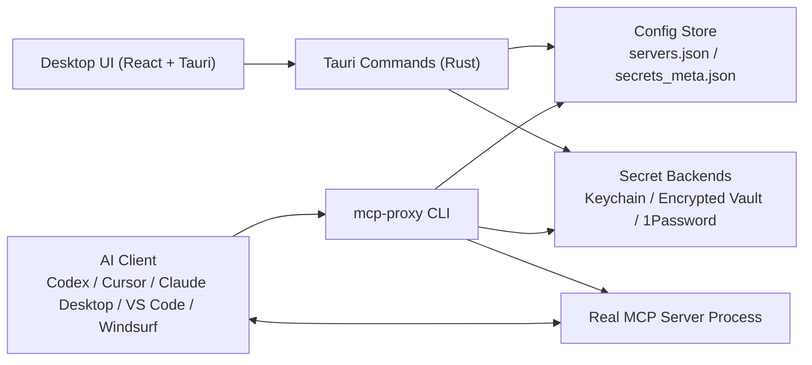

# MCP Proxy

[](https://github.com/paderlol/mcp-proxy/actions/workflows/ci.yml)
[](LICENSE)
[](https://tauri.app/)
[](https://www.rust-lang.org/)
[](https://nodejs.org/)
[](#)
[](#testing)

Secret management desktop app and CLI for MCP (Model Context Protocol) servers.

MCP Proxy lets you store API keys once, map them to MCP servers, and generate client configs without writing secrets into Claude Desktop, Codex, Cursor, VS Code, or Windsurf config files.

中文文档见 [README.zh-CN.md](README.zh-CN.md).

## Overview

MCP servers usually expect secrets as environment variables, but AI clients only know how to launch commands. MCP Proxy sits between the client and the real MCP server:

1. You configure servers and secret mappings in the desktop app.
2. The app stores metadata locally and stores secret values in a secure backend.
3. The AI client launches `mcp-proxy run <server-id>`.
4. The CLI resolves secrets at runtime and starts the real MCP server.
5. MCP traffic continues over stdio, while secrets stay out of client config files.

## Architecture

### High-level system



### Main components

- `src/`: React 19 frontend for server management, secrets, config generation, and settings.
- `src-tauri/`: Tauri v2 desktop shell and Rust command handlers.
- `crates/mcp-proxy-common/`: shared models, local vault implementation, secret resolution, and data-dir helpers.
- `crates/mcp-proxy-cli/`: standalone `mcp-proxy` binary used by AI clients.
- `crates/mcp-proxy-agent/`: tiny binary injected into Docker sandbox images to receive secrets over stdin and `exec()` the target MCP server.

### Request flow

#### Local mode

```text
AI Client
  -> mcp-proxy run <server-id>
  -> load server config + secret metadata
  -> resolve secret values from backend
  -> spawn real MCP server with env vars
  -> pass stdio through unchanged
```

#### Docker sandbox mode

```text
AI Client
  -> mcp-proxy run <server-id>
  -> resolve secret values
  -> build cached Docker image if missing
  -> docker run -i --rm <image>
  -> send one JSON line on stdin with env vars + command + args
  -> mcp-proxy-agent execs the real MCP server
  -> pass MCP traffic through stdio
```

### Data model

- `McpServerConfig`: server command, args, transport, run mode, trust flag, env mappings.
- `EnvMapping`: environment variable name -> secret reference.
- `SecretMeta`: secret metadata only; the value lives in a secure backend.
- `SecretSource`: `Local` or `OnePassword`.
- `RunMode`: `Local` or `DockerSandbox`.
- `Transport`: `Stdio` or `Sse`.

### Storage and security boundaries

- Secret values are not written into generated AI client config files.
- Local secret storage uses macOS Keychain on macOS, or an AES-256-GCM encrypted vault on platforms without Keychain support.
- 1Password secrets are resolved on demand with `op read` and are not cached in project config.
- Secret values are zeroized where implemented via the `zeroize` crate.
- Docker sandbox mode sends secrets over stdin instead of Docker env vars, Dockerfiles, or image layers.

## Features

- Desktop app built with Tauri v2, React 19, TypeScript, Vite 6, and Tailwind CSS 4
- Curated MCP registry with international and China-focused entries
- Secret backends: macOS Keychain, encrypted local vault, and 1Password CLI
- Runtime secret injection through the `mcp-proxy` CLI
- Config generation for Codex Desktop, Codex TOML, Cursor, VS Code, and Windsurf
- Optional Docker sandbox mode for untrusted MCP servers
- Automated test coverage across Rust, frontend unit tests, and Playwright E2E

## Repository layout

```text
mcp-proxy/
├── src/                        # React frontend
├── src-tauri/                  # Tauri desktop app and Rust commands
├── crates/
│   ├── mcp-proxy-common/       # Shared models, vault, store helpers
│   ├── mcp-proxy-cli/          # CLI used by AI clients
│   └── mcp-proxy-agent/        # Docker-side launcher
├── tests/e2e/                  # Playwright UI tests
├── docs/                       # Additional project docs
├── DESIGN.md                   # UI and visual system
├── TEST_RULES.md               # Testing policy
└── SECURITY_TODO.md            # Known security gaps and follow-up work
```

## Supported run modes

| Mode | What it does | Tradeoff |
| --- | --- | --- |
| Local | Spawns the real MCP server directly on the host with injected env vars | Fastest, but no process isolation |
| Docker Sandbox | Builds and runs a containerized launcher that receives secrets over stdin | Better isolation, but slower first run due to image build |

## Supported AI clients

| Client | Config format |
| --- | --- |
| Codex Desktop | JSON |
| Codex | TOML |
| Cursor | JSON |
| VS Code | JSON |
| Windsurf | JSON |

## Tech stack

### Frontend

- React 19
- TypeScript
- Vite 6
- Tailwind CSS 4
- Zustand
- React Router 7

### Backend

- Rust
- Tauri v2
- Tokio
- Serde

### Security and storage

- macOS Keychain via `keyring`
- AES-256-GCM encrypted local vault
- Argon2id key derivation
- 1Password CLI integration via `op`

## Development

### Prerequisites

- Node.js and npm
- Rust toolchain
- Tauri build prerequisites for your platform
- Optional: Docker Desktop for sandbox mode
- Optional: 1Password CLI for `OnePassword` secret sources

### Install

```bash
npm install
```

### Run in development

```bash
cargo tauri dev
```

### Frontend only

```bash
npm run dev
```

### Production build

```bash
cargo tauri build
```

### CLI build

```bash
cargo build -p mcp-proxy-cli --release
```

## Testing

Current automated suites in this repository:

- Rust workspace tests: `78`
- Frontend Vitest tests: `14`
- Playwright E2E tests: `10`

### Run all core tests

```bash
cargo test --workspace
npm test
npm run test:e2e
```

### Notes

- Playwright may use your locally installed Chrome by default instead of downloading the bundled Chromium build.
- Some tests create temporary directories through the OS temp location.
- Docker sandbox behavior has focused Rust coverage; the desktop app configures server entries, while actual execution happens later through AI clients invoking `mcp-proxy run`.

## Documentation

- [DESIGN.md](DESIGN.md): visual language and UI conventions
- [TEST_RULES.md](TEST_RULES.md): testing policy and suite details
- [SECURITY_TODO.md](SECURITY_TODO.md): known security gaps and future hardening work
- [docs/e2e-manual.md](docs/e2e-manual.md): manual end-to-end verification notes

## Status

The core desktop app, CLI runtime path, config generation, and automated test suites are implemented and working. Docker sandbox support is implemented in the CLI/runtime path, while the desktop app currently focuses on configuration rather than directly launching servers.

## License

Licensed under the [PolyForm Noncommercial License 1.0.0](LICENSE).

You may use, modify, and redistribute this software **for any noncommercial purpose** — personal use, research, education, hobby projects, and use by nonprofit / public organizations are all permitted.

**Commercial use is not permitted under this license.** If you would like to use MCP Proxy for commercial purposes, please contact the author to discuss a separate commercial license.
