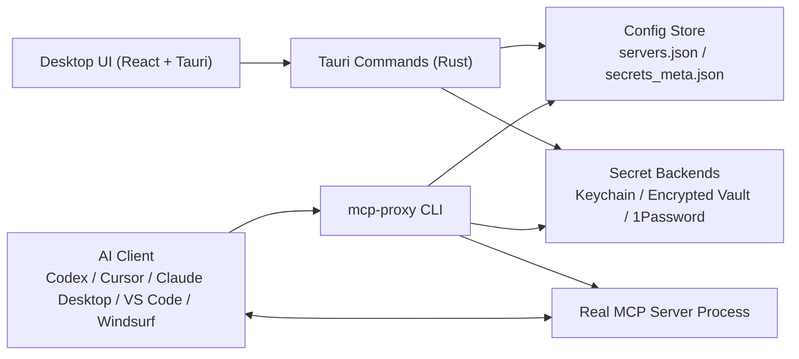

# MCP Proxy

Secret management desktop app and CLI for MCP (Model Context Protocol) servers.

MCP Proxy lets you store API keys once, map them to MCP servers, and generate client configs without writing secrets into Claude Desktop, Codex, Cursor, VS Code, or Windsurf config files.

中文文档见 [README.zh-CN.md](README.zh-CN.md).

## Overview

MCP servers usually expect secrets as environment variables, but AI clients only know how to launch commands. MCP Proxy sits between the client and the real MCP server:

1. You configure servers and secret mappings in the desktop app.
2. The app stores metadata locally and stores secret values in a secure backend.
3. The AI client launches `mcp-proxy run <server-id>`.
4. The CLI resolves secrets at runtime and starts the real MCP server.
5. MCP traffic continues over stdio, while secrets stay out of client config files.

## Architecture

### High-level system



### Main components

- `src/`: React 19 frontend for server management, secrets, config generation, and settings.
- `src-tauri/`: Tauri v2 desktop shell and Rust command handlers.
- `crates/mcp-proxy-common/`: shared models, local vault implementation, secret resolution, and data-dir helpers.
- `crates/mcp-proxy-cli/`: standalone `mcp-proxy` binary used by AI clients.
- `crates/mcp-proxy-agent/`: tiny binary injected into Docker sandbox images to receive secrets over stdin and `exec()` the target MCP server.

### Request flow

#### Local mode

```text
AI Client
  -> mcp-proxy run <server-id>
  -> load server config + secret metadata
  -> resolve secret values from backend
  -> spawn real MCP server with env vars
  -> pass stdio through unchanged
```

On macOS, setting `sandbox_local = true` on a server (toggle in the "Servers"
page under Local mode) wraps the child in `sandbox-exec(1)` with a
locally-generated `.sb` profile: reads are broad with a denylist for secret
stores (`~/.ssh`, `~/.aws`, `~/Library/Keychains`, `~/.gnupg`,
`~/.config/gh`, `/etc/master.passwd`, `/etc/sudoers`), writes are scoped to
`$TMPDIR` plus `~/Library/Caches/mcp-proxy/<server-id>/`, and network access
stays on. The flag is ignored on Linux and Windows (no wrapper exists yet);
if `/usr/bin/sandbox-exec` is missing the CLI logs a warning and spawns
directly. Turn it off by flipping the toggle back or editing the server JSON.

#### Docker sandbox mode

```text
AI Client
  -> mcp-proxy run <server-id>
  -> resolve secret values
  -> build cached Docker image if missing
  -> docker run -i --rm <image>
  -> send one JSON line on stdin with env vars + command + args
  -> mcp-proxy-agent execs the real MCP server
  -> pass MCP traffic through stdio
```

### Data model

- `McpServerConfig`: server command, args, transport, run mode, trust flag, env mappings.
- `EnvMapping`: environment variable name -> secret reference.
- `SecretMeta`: secret metadata only; the value lives in a secure backend.
- `SecretSource`: `Local` or `OnePassword`.
- `RunMode`: `Local` or `DockerSandbox`.
- `Transport`: `Stdio` or `Sse`.

### Storage and security boundaries

- Secret values are not written into generated AI client config files.
- Local secret storage uses macOS Keychain on macOS by default, or an AES-256-GCM encrypted vault on platforms without Keychain support. macOS users can opt into the encrypted vault instead of Keychain via **Settings → Security → Switch to Local Vault**; the choice is persisted so the CLI and GUI agree. Switching backends does not migrate existing secrets.
- 1Password secrets are resolved on demand with `op read` and are not cached in project config.
- Secret values are zeroized where implemented via the `zeroize` crate.
- Docker sandbox mode sends secrets over stdin instead of Docker env vars, Dockerfiles, or image layers.

## Features

- Desktop app built with Tauri v2, React 19, TypeScript, Vite 6, and Tailwind CSS 4
- Curated MCP registry with international and China-focused entries
- Secret backends: macOS Keychain, encrypted local vault, and 1Password CLI
- Runtime secret injection through the `mcp-proxy` CLI
- Config generation for Codex Desktop, Codex TOML, Cursor, VS Code, and Windsurf
- Optional Docker sandbox mode for untrusted MCP servers
- Automated test coverage across Rust, frontend unit tests, and Playwright E2E

## Repository layout

```text
mcp-proxy/
├── src/                        # React frontend
├── src-tauri/                  # Tauri desktop app and Rust commands
├── crates/
│   ├── mcp-proxy-common/       # Shared models, vault, store helpers
│   ├── mcp-proxy-cli/          # CLI used by AI clients
│   └── mcp-proxy-agent/        # Docker-side launcher
├── tests/e2e/                  # Playwright UI tests
└── docs/
    ├── DESIGN.md               # UI and visual system
    ├── TEST_RULES.md           # Testing policy
    ├── SECURITY_TODO.md        # Known security gaps and follow-up work
    └── e2e-manual.md           # Manual AI-client verification walkthrough
```

## Supported run modes

| Mode | What it does | Tradeoff |
| --- | --- | --- |
| Local | Spawns the real MCP server directly on the host with injected env vars | Fastest, but no process isolation |
| Docker Sandbox | Builds and runs a containerized launcher that receives secrets over stdin | Better isolation, but slower first run due to image build |

## Trust model — read this before launching any server

Every MCP server in this app carries a `trusted` flag. It is the single user-facing lever that decides both **whether the CLI will launch the server at all** and **what Docker network policy applies** when sandboxing is on. Please treat it as load-bearing — not a UI decoration.

### What `trusted` controls

| Scenario | `trusted = false` (default for new servers) | `trusted = true` |
| --- | --- | --- |
| Local run mode | **Blocked.** `mcp-proxy run` refuses to launch; the AI client sees an error asking you to review and mark it Trusted. | Launches normally. |
| Docker sandbox, no `--network` flag in `extra_args` | **Blocked** at the trust gate. The server is not launched — the error tells you to either mark it Trusted or pick an explicit network policy. | Launches with Docker's default **bridge** network (can reach external APIs, same as local mode). |
| Docker sandbox, explicit `--network=...` in `extra_args` | **Launches**, using your explicit policy. The CLI takes that as an informed choice. | Launches with your explicit policy (trust flag is effectively bypassed by the explicit setting — still the operator's choice). |

### Why the default for untrusted sandbox is `--network=none`

The point of the sandbox is to contain MCP servers you have not yet reviewed. A malicious or compromised server with a network connection can exfiltrate any secret you have mapped to it — in milliseconds, to any endpoint. The default policy for anything untrusted is therefore **no network at all**. Since most real MCP servers (GitHub, Slack, web fetchers, …) need network to function, the expected workflow is:

1. Add the server. It starts as `Untrusted`.
2. Review the package, command, and arguments in the desktop app.
3. Flip it to `Trusted` — now it runs with the default bridge network, same as any other app on your machine.

If you genuinely want to run a server as untrusted but with some network access, edit `extra_args` in `servers.json` to include an explicit `--network=...` flag. That counts as a conscious choice and the CLI will let it through the trust gate.

### What operators should do

- Leave new servers as **Untrusted** until you have read their source / docs.
- Prefer flipping to **Trusted** over keeping things untrusted-with-network-overrides. Explicit overrides are an escape hatch, not the main path.
- If you must run untrusted servers, prefer sandbox mode with the default `--network=none` policy — this blocks the exfiltration path entirely.
- Never share a machine account that has trusted servers you did not personally review.

The relevant code: trust gate in [crates/mcp-proxy-cli/src/main.rs](crates/mcp-proxy-cli/src/main.rs), network policy in [crates/mcp-proxy-cli/src/docker.rs](crates/mcp-proxy-cli/src/docker.rs) (`resolve_network_flag`).

### Container logging

Every `docker run` invocation also gets `--log-driver=none` injected by default, so the one-line JSON secret payload written to container stdin cannot be captured by a non-default Docker log driver (`journald`, `fluentd`, `splunk`, `gelf`, …). Docker's default `json-file` driver does not record stdin, so this is defense in depth. If you need container logging, set `--log-driver=...` (or `--log-driver ...`) in the server's `extra_args` and your choice wins.

## Supported AI clients

| Client | Config format |
| --- | --- |
| Codex Desktop | JSON |
| Codex | TOML |
| Cursor | JSON |
| VS Code | JSON |
| Windsurf | JSON |

## Tech stack

### Frontend

- React 19
- TypeScript
- Vite 6
- Tailwind CSS 4
- Zustand
- React Router 7

### Backend

- Rust
- Tauri v2
- Tokio
- Serde

### Security and storage

- macOS Keychain via `keyring`
- AES-256-GCM encrypted local vault
- Argon2id key derivation
- 1Password CLI integration via `op`

## Development

### Prerequisites

- Node.js and npm
- Rust toolchain
- Tauri build prerequisites for your platform
- Optional: Docker Desktop for sandbox mode
- Optional: 1Password CLI for `OnePassword` secret sources

### Install

```bash
npm install
```

### Run in development

```bash
cargo tauri dev
```

### Frontend only

```bash
npm run dev
```

### Production build

```bash
cargo tauri build
```

### CLI build

```bash
cargo build -p mcp-proxy-cli --release
```

## Testing

Current automated suites in this repository:

- Rust workspace tests: `78`
- Frontend Vitest tests: `14`
- Playwright E2E tests: `10`

### Run all core tests

```bash
cargo test --workspace
npm test
npm run test:e2e
```

### Notes

- Playwright may use your locally installed Chrome by default instead of downloading the bundled Chromium build.
- Some tests create temporary directories through the OS temp location.
- Docker sandbox behavior has focused Rust coverage; the desktop app configures server entries, while actual execution happens later through AI clients invoking `mcp-proxy run`.

## Documentation

- [docs/DESIGN.md](docs/DESIGN.md): visual language and UI conventions
- [docs/TEST_RULES.md](docs/TEST_RULES.md): testing policy and suite details
- [docs/SECURITY_TODO.md](docs/SECURITY_TODO.md): known security gaps and future hardening work
- [docs/e2e-manual.md](docs/e2e-manual.md): manual end-to-end verification notes

## Status

The core desktop app, CLI runtime path, config generation, and automated test suites are implemented and working. Docker sandbox support is implemented in the CLI/runtime path, while the desktop app currently focuses on configuration rather than directly launching servers.

## License

TBD.
