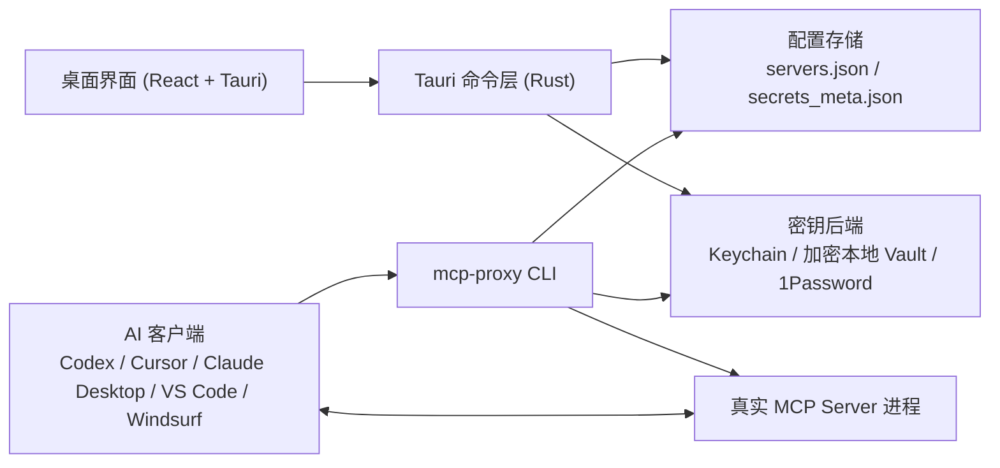

# MCP Proxy

MCP (Model Context Protocol) Server 的密钥管理桌面应用和 CLI。

MCP Proxy 的目标是让你只保存一次 API Key 或 Token，在桌面应用里完成服务配置和密钥映射，然后生成 AI 客户端配置文件，而不用把密钥明文写进 Claude Desktop、Codex、Cursor、VS Code 或 Windsurf 的配置中。

English documentation: [README.md](README.md)

## 概览

很多 MCP Server 都要求通过环境变量读取密钥，但 AI 客户端通常只会启动一个命令。MCP Proxy 正是夹在 AI 客户端和真实 MCP Server 之间的这一层：

1. 你在桌面应用中配置 Server 和密钥映射。
2. 应用把 Server 元数据保存在本地，把密钥值放在安全后端中。
3. AI 客户端执行 `mcp-proxy run <server-id>`。
4. CLI 在运行时解析密钥并启动真实 MCP Server。
5. MCP 协议流量继续走 stdio，而密钥不会进入客户端配置文件。

## 系统架构

### 高层结构



### 核心组件

- `src/`: React 19 前端，负责 Server 管理、密钥管理、配置生成和设置页。
- `src-tauri/`: Tauri v2 桌面外壳和 Rust 命令处理层。
- `crates/mcp-proxy-common/`: 共享模型、本地 Vault、密钥解析和数据目录工具。
- `crates/mcp-proxy-cli/`: 提供给 AI 客户端调用的 `mcp-proxy` 可执行文件。
- `crates/mcp-proxy-agent/`: 注入到 Docker 沙箱镜像中的微型二进制，用 stdin 接收密钥后 `exec()` 真实 MCP Server。

### 请求链路

#### 本地模式

```text
AI 客户端
  -> mcp-proxy run <server-id>
  -> 加载服务配置和密钥元数据
  -> 从安全后端解析密钥值
  -> 注入环境变量并启动真实 MCP Server
  -> stdio 透明透传
```

#### Docker 沙箱模式

```text
AI 客户端
  -> mcp-proxy run <server-id>
  -> 解析密钥值
  -> 若镜像不存在则构建缓存镜像
  -> docker run -i --rm <image>
  -> 通过 stdin 首行发送 JSON，包含 env vars、command、args
  -> mcp-proxy-agent exec 真实 MCP Server
  -> MCP 流量继续走 stdio
```

### 数据模型

- `McpServerConfig`: 服务命令、参数、传输方式、运行模式、信任标记、环境变量映射。
- `EnvMapping`: 环境变量名 -> 密钥引用。
- `SecretMeta`: 只保存密钥元数据，密钥值本身存放在安全后端。
- `SecretSource`: `Local` 或 `OnePassword`。
- `RunMode`: `Local` 或 `DockerSandbox`。
- `Transport`: `Stdio` 或 `Sse`。

### 存储与安全边界

- 生成的 AI 客户端配置文件中不会包含密钥值。
- 本地密钥存储在 macOS 上优先使用 Keychain；无 Keychain 的平台使用 AES-256-GCM 加密 Vault。
- 1Password 密钥在运行时通过 `op read` 读取，不缓存到项目配置里。
- 部分敏感值使用 `zeroize` 做内存清理。
- Docker 沙箱模式通过 stdin 传递密钥，不通过 Docker 环境变量、Dockerfile 或镜像层暴露。

## 功能特性

- 基于 Tauri v2、React 19、TypeScript、Vite 6、Tailwind CSS 4 的桌面应用
- 自带国际版和国内版的 MCP 注册表条目
- 支持 macOS Keychain、加密本地 Vault、1Password CLI 三种密钥后端
- 通过 `mcp-proxy` CLI 在运行时注入密钥
- 支持为 Codex Desktop、Codex TOML、Cursor、VS Code、Windsurf 生成配置
- 可选 Docker 沙箱模式，用于隔离不受信任的 MCP Server
- 覆盖 Rust、前端单测和 Playwright E2E 的自动化测试

## 仓库结构

```text
mcp-proxy/
├── src/                        # React 前端
├── src-tauri/                  # Tauri 桌面应用和 Rust 命令
├── crates/
│   ├── mcp-proxy-common/       # 共享模型、Vault、存储工具
│   ├── mcp-proxy-cli/          # AI 客户端调用的 CLI
│   └── mcp-proxy-agent/        # Docker 容器内启动器
├── tests/e2e/                  # Playwright UI 测试
├── docs/                       # 额外文档
├── DESIGN.md                   # UI 设计规范
├── TEST_RULES.md               # 测试策略
└── SECURITY_TODO.md            # 安全缺口与后续事项
```

## 支持的运行模式

| 模式 | 作用 | 权衡 |
| --- | --- | --- |
| Local | 直接在宿主机启动真实 MCP Server，并注入环境变量 | 最快，但没有进程隔离 |
| Docker Sandbox | 构建并运行容器化启动器，通过 stdin 接收密钥 | 隔离更强，但首次运行更慢 |

## 信任模型 — 启动任何 Server 前请务必阅读

应用里的每个 MCP Server 都带有一个 `trusted` 标记。这个标记是**单一的关键开关**，同时决定了 **CLI 是否允许启动该 Server**，以及在 Docker 沙箱模式下**使用哪种网络策略**。它不是 UI 摆设，请务必严肃对待。

### `trusted` 控制了什么

| 场景 | `trusted = false`（新 Server 的默认值） | `trusted = true` |
| --- | --- | --- |
| 本地（Local）模式 | **被拒绝启动。** `mcp-proxy run` 会直接报错，提示你在桌面应用里审查后标记为 Trusted。 | 正常启动。 |
| Docker 沙箱，`extra_args` 中没有 `--network` 参数 | **在信任关口被拦截**，根本不会启动；错误信息提示你要么把 Server 标记为 Trusted，要么显式设置一条网络策略。 | 使用 Docker 默认的 **bridge** 网络启动（可访问外部 API，和本地模式在网络面上等价）。 |
| Docker 沙箱，`extra_args` 中有显式 `--network=...` | **会启动**，并使用你显式指定的策略。CLI 把它视为你已经做出了知情决定。 | 使用你指定的策略启动（显式设定会覆盖默认，仍然是操作者的主动选择）。 |

### 为什么未信任的沙箱默认是 `--network=none`

沙箱的意义就在于隔离尚未审查过的 MCP Server。一个恶意或已被攻陷的 Server，只要有一条出网连接，就能在毫秒级把所有映射给它的密钥发到任何外部地址。所以任何未被信任的容器，默认策略都是**完全不连网**。绝大多数真实 MCP Server（GitHub、Slack、网页抓取等）都需要网络，所以标准工作流是：

1. 添加 Server，默认就是 `Untrusted`。
2. 在桌面应用里审查包源、命令、参数。
3. 把它切为 `Trusted` — 此后沙箱会使用默认 bridge 网络，和本机其它程序一样。

如果你确实希望在未信任状态下给 Server 网络权限，就在 `servers.json` 的 `extra_args` 里加上显式的 `--network=...` 标志。这被视为一次知情选择，CLI 会放行信任关口。

### 操作者建议

- 新加入的 Server 默认保持 **Untrusted**，直到你读过它的源码或文档。
- **优先标记为 Trusted**，而不是靠 `extra_args` 放通网络。显式覆盖是一条后门，不应成为常态。
- 如果非要运行未信任的 Server，请用沙箱模式并保留默认 `--network=none`，从根上阻断外泄路径。
- 不要在共享账户上留下你没亲自审查过的 Trusted Server。

相关代码：信任关口位于 [crates/mcp-proxy-cli/src/main.rs](crates/mcp-proxy-cli/src/main.rs)，网络策略位于 [crates/mcp-proxy-cli/src/docker.rs](crates/mcp-proxy-cli/src/docker.rs) 中的 `resolve_network_flag`。

### 容器日志

每次 `docker run` 还会默认注入 `--log-driver=none`，避免写入容器 stdin 的那一行 JSON 密钥负载被非默认日志驱动（`journald`、`fluentd`、`splunk`、`gelf` 等）捕获持久化。Docker 默认的 `json-file` 驱动不记录 stdin，所以这是一条深度防御。如果确实需要容器日志，在 Server 的 `extra_args` 里加上 `--log-driver=...`（或 `--log-driver ...`），你的设置会覆盖默认行为。

## 支持的 AI 客户端

| 客户端 | 配置格式 |
| --- | --- |
| Codex Desktop | JSON |
| Codex | TOML |
| Cursor | JSON |
| VS Code | JSON |
| Windsurf | JSON |

## 技术栈

### 前端

- React 19
- TypeScript
- Vite 6
- Tailwind CSS 4
- Zustand
- React Router 7

### 后端

- Rust
- Tauri v2
- Tokio
- Serde

### 安全与存储

- 通过 `keyring` 对接 macOS Keychain
- AES-256-GCM 加密本地 Vault
- Argon2id 密钥派生
- 通过 `op` 集成 1Password CLI

## 开发

### 依赖前置

- Node.js 和 npm
- Rust toolchain
- 当前平台对应的 Tauri 构建依赖
- 可选：Docker Desktop，用于沙箱模式
- 可选：1Password CLI，用于 `OnePassword` 类型密钥

### 安装依赖

```bash
npm install
```

### 开发运行

```bash
cargo tauri dev
```

### 仅启动前端

```bash
npm run dev
```

### 生产构建

```bash
cargo tauri build
```

### 构建 CLI

```bash
cargo build -p mcp-proxy-cli --release
```

## 测试

当前仓库中的自动化测试规模：

- Rust 工作区测试：`78`
- 前端 Vitest：`14`
- Playwright E2E：`10`

### 运行主要测试

```bash
cargo test --workspace
npm test
npm run test:e2e
```

### 说明

- Playwright 默认优先使用本机已安装的 Chrome，而不是强制下载自带 Chromium。
- 部分测试会使用操作系统的临时目录创建临时文件。
- Docker 沙箱路径目前主要覆盖在 CLI 测试中；桌面应用当前主要负责配置，真正执行仍由 AI client 后续调用 `mcp-proxy run` 完成。

## 相关文档

- [DESIGN.md](DESIGN.md): 视觉语言和 UI 约定
- [TEST_RULES.md](TEST_RULES.md): 测试策略和详细说明
- [SECURITY_TODO.md](SECURITY_TODO.md): 已知安全缺口和后续加固方向
- [docs/e2e-manual.md](docs/e2e-manual.md): 手动端到端验证说明

## 当前状态

桌面应用主流程、CLI 运行链路、配置生成和自动化测试已经可用。Docker 沙箱能力已经在 CLI / runtime 路径实现，桌面端当前以配置管理为主，不直接承担 server 启动职责。

## License

TBD.
